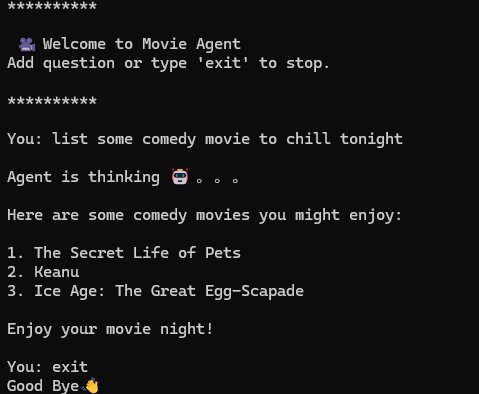

# LLM Moive Agent

LLM moive agent repo test. \
I don't own the code. I just want to test LLM agent from CLI and tried to extract some code from original repo.

Credit to original repo: [https://github.com/tomasonjo/llm-movieagent](https://github.com/tomasonjo/llm-movieagent)

### 1. Virtual Environment Setup

This is for Windows environment.
```
python -m venv movie-agent
.\movie-agent\Scripts\activate.ps1
```
install dependencies
```
pip install -r requirements.txt
```

### 2. Setup Environment Variables
Insert your API key in `.env_example` and rename it to `.env` 
```
OPENAI_API_KEY=your_key

NEO4J_URI=neo4j+s://...
NEO4J_USERNAME=neo4j
NEO4J_PASSWORD=your_password
```

### 3. Construct Neo4j GraphDB
run `make_db.py` to build Neo4j GraphDB.
```
python make_db.py
```

### 4. Test Movie Agent 
```
python .\neo4j-semantic-layer\main.py
```

### 5. Sample CLI

